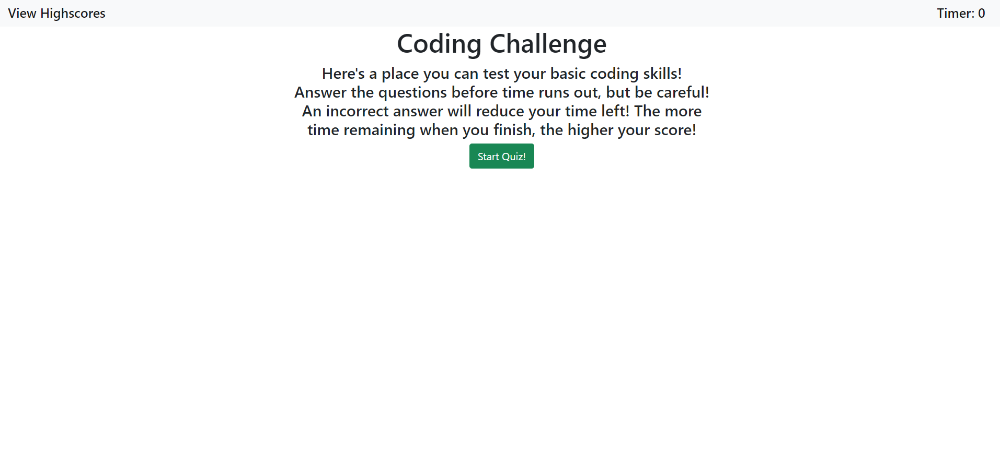

# Code-Quiz

This is a short quiz to test basic coding knowledge.

You can start the quiz from the main section, or you can click "View Highscores" to view your personal times. This will be blank until a score is saved after completing the quiz.

When the quiz starts, you will be presented with a question and four possible answer buttons. Clicking any of the buttons will progress you to the next question, but if the answer is incorrect your remaining time will also be deducted 15 seconds.

When the last question is answered, it will bring you to a screen which allows you to input your name to save your score. This name and score will be saved to local storage in the format "Name: Score" which will be added to the scores list in the "View Highscores Section."

If desired, the scores list can be deleted by pressing the "Delete Scores!" button in the "View Highscores" section.

The deployed website: https://djlongarms.github.io/Code-Quiz

A screenshot of the page: 